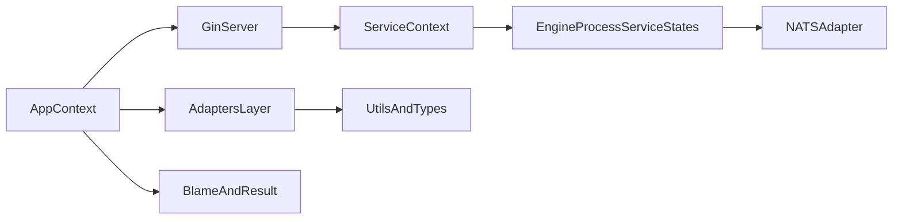

# Neuron

`neuron` is an internal Go framework library for building service backends with shared patterns for:

- application/service context wiring
- HTTP and gRPC server wrappers
- NATS event orchestration and subscriber handling
- auth/session/token primitives
- data adapters (Postgres, MySQL, Mongo, Redis, OpenSearch)
- cloud/file/payment integrations
- structured errors and result handling

Module: `github.com/abhissng/neuron`

## What This Library Is (and Is Not)

`neuron` is a reusable backend foundation for internal services.

Use it when you want:

- shared context wiring across services
- standardized API/error patterns
- consistent integrations for transport, storage, auth, and observability

It is **not** a standalone app or CLI. You import selected packages and compose them into your service.

## Who Should Read This

- **Service developers**: start from Quick Start and Key Workflows.
- **Platform/infrastructure engineers**: jump to Package Map and adapter docs.
- **Maintainers**: read Internal API Stability Notes and deep docs under `docs/`.

## Quick Start

### 1) Private module access

```bash
go env -w GOPRIVATE=github.com/abhissng/*
```

Use SSH for GitHub access as needed by your environment.

### 2) Add dependency

```bash
go get github.com/abhissng/neuron
```

### 3) Bootstrap core context

```go
import (
	"github.com/abhissng/neuron/context"
	"github.com/abhissng/neuron/utils/types"
)

appCtx := context.NewAppContext(
	context.WithServiceID(types.Service("orders")),
)
_ = appCtx
```

### 4) Next step after bootstrap

After creating `AppContext`, choose one path:

- build HTTP APIs with Gin wrappers: [`docs/adapters/http-and-gin.md`](docs/adapters/http-and-gin.md)
- build workflow/event services: [`docs/core/engine.md`](docs/core/engine.md)
- wire adapters into context (DB/auth/cache/payment/cloud): [`USAGE.md`](USAGE.md)

## Quick Learning Paths

### Path A: Build a REST service

1. Read [`docs/core/context.md`](docs/core/context.md)
2. Read [`docs/adapters/http-and-gin.md`](docs/adapters/http-and-gin.md)
3. Read [`docs/core/blame-and-result.md`](docs/core/blame-and-result.md)
4. Add data adapter docs from [`docs/adapters/data-and-storage.md`](docs/adapters/data-and-storage.md)

### Path B: Build an event-driven workflow service

1. Read [`docs/core/context.md`](docs/core/context.md)
2. Read [`docs/adapters/events-and-messaging.md`](docs/adapters/events-and-messaging.md)
3. Read [`docs/core/engine.md`](docs/core/engine.md)
4. Add auth/session concerns from [`docs/adapters/auth-and-security.md`](docs/adapters/auth-and-security.md)

### Path C: Integrate external systems quickly

1. Cloud/file: [`docs/adapters/cloud-and-file.md`](docs/adapters/cloud-and-file.md)
2. Payment/email: [`docs/adapters/payment-and-email.md`](docs/adapters/payment-and-email.md)
3. Ops/logging/metrics: [`docs/adapters/ops-and-observability.md`](docs/adapters/ops-and-observability.md)

## Architecture



## Key Workflows

- **HTTP Request Path**: Gin server -> middleware chain -> `ServiceContext` -> handler wrapper -> result/blame response mapping.
- **Service Orchestration Path**: `engine.ProcessServiceStates` -> NATS publish/wait -> state progression -> rollback path on failure.
- **Auth Path**: PASETO/JWT/session middleware -> claims/session extraction -> protected handler execution.
- **Adapter Access Path**: `AppContext` acts as the integration hub for DB/cloud/cache/payment/log/event managers.

## End-to-End Mental Model

Use this as the default execution model when onboarding:

1. Service starts and builds `AppContext`.
2. Transport layer (Gin/gRPC/NATS subscriber) creates request-scoped `ServiceContext`.
3. Handler/business flow runs with shared managers fetched from context.
4. Errors are normalized via `blame` and returned via consistent response envelopes.
5. Optional engine orchestration fans out to NATS service states and rollback logic.

## Practical Integration Example

This is a minimal composition sketch showing how pieces fit together:

```go
// bootstrap.go
appCtx := context.NewAppContext(
	context.WithServiceID(types.Service("orders")),
	context.WithLogger(logger),
	context.WithNATSManager(natsMgr),
	context.WithPostgresDB(pgDB),
	context.WithPaymentManager(paymentMgr),
)

// route handler (conceptual)
func CreateOrder(sc *context.ServiceContext) error {
	log := sc.FetchLogger()
	db := sc.FetchDatabase()
	_ = log
	_ = db
	return nil
}
```

For concrete package-by-package usage, use [`USAGE.md`](USAGE.md).

## Package Map

### Core

- [`context`](context)
- [`engine`](engine)
- [`blame`](blame)
- [`result`](result)
- [`database`](database)

### Adapters

- [`adapters/aws`](adapters/aws), [`adapters/cloud`](adapters/cloud), [`adapters/oci`](adapters/oci)
- [`adapters/gin/server`](adapters/gin/server), [`adapters/gin/middleware`](adapters/gin/middleware), [`adapters/gin/handler`](adapters/gin/handler), [`adapters/gin/request`](adapters/gin/request)
- [`adapters/events/nats`](adapters/events/nats), [`adapters/events/rabbitmq`](adapters/events/rabbitmq), [`adapters/events`](adapters/events)
- [`adapters/http`](adapters/http), [`adapters/grpcserver`](adapters/grpcserver)
- [`adapters/postgres`](adapters/postgres), [`adapters/mysql`](adapters/mysql), [`adapters/mongo`](adapters/mongo), [`adapters/redis`](adapters/redis), [`adapters/opensearch`](adapters/opensearch), [`adapters/cosmos`](adapters/cosmos)
- [`adapters/paseto`](adapters/paseto), [`adapters/jwt`](adapters/jwt), [`adapters/session`](adapters/session), [`adapters/vault`](adapters/vault)
- [`adapters/payment`](adapters/payment), [`adapters/payment/razorpay`](adapters/payment/razorpay)
- [`adapters/file`](adapters/file), [`adapters/file/uploadFile`](adapters/file/uploadFile)
- [`adapters/email`](adapters/email), [`adapters/log`](adapters/log), [`adapters/prometheus`](adapters/prometheus), [`adapters/store`](adapters/store), [`adapters/store/regex`](adapters/store/regex), [`adapters/validator`](adapters/validator), [`adapters/viper`](adapters/viper)

### Utilities

- [`utils/helpers`](utils/helpers), [`utils/types`](utils/types), [`utils/constant`](utils/constant)
- [`utils/structures`](utils/structures), [`utils/structures/claims`](utils/structures/claims), [`utils/structures/message`](utils/structures/message), [`utils/structures/service`](utils/structures/service), [`utils/structures/discovery`](utils/structures/discovery), [`utils/structures/acknowledgment`](utils/structures/acknowledgment)
- [`utils/cache`](utils/cache), [`utils/cryptography`](utils/cryptography), [`utils/circuitBreaker`](utils/circuitBreaker), [`utils/timeutil`](utils/timeutil), [`utils/workerpool`](utils/workerpool), [`utils/schedule`](utils/schedule), [`utils/concurrent/concurrentMap`](utils/concurrent/concurrentMap), [`utils/random`](utils/random), [`utils/idempotency`](utils/idempotency), [`utils/graceful`](utils/graceful), [`utils/codec`](utils/codec)

## Documentation Index

- Deep docs root: [`docs/README.md`](docs/README.md)
- Full usage index: [`USAGE.md`](USAGE.md)
- Core docs:
  - [`docs/core/context.md`](docs/core/context.md)
  - [`docs/core/engine.md`](docs/core/engine.md)
  - [`docs/core/blame-and-result.md`](docs/core/blame-and-result.md)
  - [`docs/core/database.md`](docs/core/database.md)
- Adapter docs:
  - [`docs/adapters/http-and-gin.md`](docs/adapters/http-and-gin.md)
  - [`docs/adapters/events-and-messaging.md`](docs/adapters/events-and-messaging.md)
  - [`docs/adapters/auth-and-security.md`](docs/adapters/auth-and-security.md)
  - [`docs/adapters/data-and-storage.md`](docs/adapters/data-and-storage.md)
  - [`docs/adapters/cloud-and-file.md`](docs/adapters/cloud-and-file.md)
  - [`docs/adapters/payment-and-email.md`](docs/adapters/payment-and-email.md)
  - [`docs/adapters/ops-and-observability.md`](docs/adapters/ops-and-observability.md)
- Utility docs:
  - [`docs/utils/helpers-and-types.md`](docs/utils/helpers-and-types.md)
  - [`docs/utils/structures.md`](docs/utils/structures.md)
  - [`docs/utils/infra-utilities.md`](docs/utils/infra-utilities.md)

## Existing Detailed Package Guides

- [`adapters/cloud/README.md`](adapters/cloud/README.md)
- [`adapters/file/uploadFile/README.md`](adapters/file/uploadFile/README.md)

## First-Service Checklist

- [ ] Configure private module access (`GOPRIVATE`, SSH)
- [ ] Create `AppContext` with required managers only
- [ ] Choose primary transport path (HTTP/gRPC/NATS)
- [ ] Standardize failure handling with `blame` + `result`
- [ ] Add at least one storage adapter and one auth strategy
- [ ] Add logging + metrics from day one
- [ ] Document service-specific wiring decisions next to bootstrap code

## Development

```bash
make all
```

This runs formatting/lint/build checks configured in the repository tooling.

## Troubleshooting

- **Cannot fetch module**: verify `GOPRIVATE` and GitHub SSH access.
- **Context values missing in handlers**: ensure middleware creates and passes `ServiceContext`.
- **Inconsistent API errors**: route failures through `blame` constructors and handler wrappers.
- **Workflow rollback confusion**: verify state definitions and rollback subjects in engine + service structures docs.

## Internal API Stability Notes

- Exported APIs are intended for internal service consumption.
- Unexported/internal functions described in docs are implementation details and may change without compatibility guarantees.
- Stub/placeholder packages (for example RabbitMQ/Cosmos draft areas) are documented for completeness but are not full production integrations.
