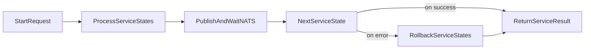

# Engine Usage

Packages covered:

- [`engine`](../../engine)

Primary files:

- [`engine/engine.go`](../../engine/engine.go)
- [`engine/subscribe.go`](../../engine/subscribe.go)
- [`engine/handler.go`](../../engine/handler.go)
- [`engine/communicator.go`](../../engine/communicator.go)
- [`engine/helper.go`](../../engine/helper.go)

## Purpose

The engine package orchestrates multi-step service workflows over NATS:

- executes service states in order
- passes payload/output state to next step
- triggers rollback flow when a step fails

## Main Entry Points

- `ProcessServiceStates`: executes state-machine style flow.
- `RollbackServiceStates`: compensates completed steps after failure.
- subscription utilities in `subscribe.go` for binding handlers and middleware.

## Typical Orchestration Flow



## Minimal Usage Pattern

```go
res, err := engine.ProcessServiceStates(
	sc,
	types.Service("orders"),
	5*time.Second,
	msg,
)
if err != nil {
	return err
}
_ = res
```

### Rollback on custom failure path

```go
if err != nil {
	bl := engine.RollbackServiceStates(sc, types.Service("orders"), res)
	_ = bl
}
```

### Subscribe with middleware

```go
_, bl := natsMgr.SubscribeWithMiddleware(
	"orders.execute",
	processor,
	nil,
	customMiddleware,
)
if bl != nil {
	return bl
}
```

## Subscription Layer

`subscribe.go` and `handler.go` wrap NATS callbacks into a standard processing shape that:

- reconstructs service context metadata from headers
- invokes domain processors
- emits structured success/failure responses

## Internal Helpers (implementation detail)

`communicator.go` and helper functions in `helper.go` are internal orchestration building blocks. They can change without compatibility guarantees.

## Caveats

- Define service state graphs carefully (`utils/structures/service` definitions).
- Ensure idempotency for handlers involved in rollback paths.
- Keep timeout policies explicit for each workflow path.
